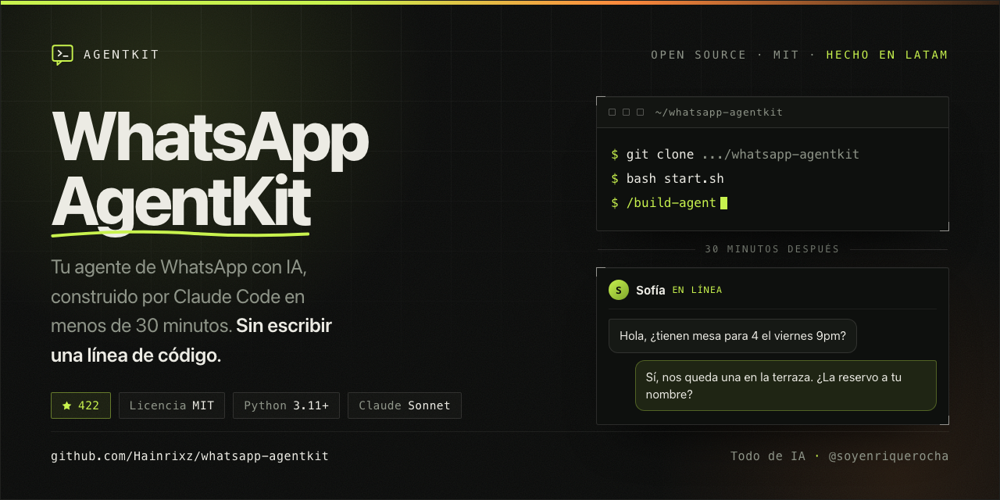

<p align="center">
  
</p>

<p align="center">
  <a href="https://github.com/Hainrixz/whatsapp-agentkit"></a>
  <a href="LICENSE"></a>
  
  
  
</p>

<p align="center">
  <b><a href="https://hainrixz.github.io/whatsapp-agentkit/">Ver el sitio</a></b> ·
  <a href="#inicio-rápido">Inicio rápido</a> ·
  <a href="#cómo-funciona">Cómo funciona</a> ·
  <a href="#preguntas-frecuentes">FAQ</a>
</p>

---

## About

**WhatsApp AgentKit convierte una conversación de 20 minutos en un agente de WhatsApp
que atiende a tus clientes.**

No es una plantilla que copias y adaptas. Es un sistema de instrucciones que Claude Code
lee para entrevistarte sobre tu negocio y después escribir, probar y desplegar el agente
completo por ti: el servidor, la conexión con WhatsApp, la memoria de cada cliente y el
prompt que le da personalidad.

Tú no escribes código. Respondes preguntas.

Lo hicimos porque el 90% del trabajo de montar un agente de WhatsApp no es la IA — es la
plomería: webhooks, firmas, tokens, reintentos, deploy. Esa parte ya está resuelta y
auditada acá adentro. Lo que queda es lo único que solo tú sabes: cómo funciona tu negocio.

Es open source, licencia MIT, y está escrito en español porque se hizo para builders
de LATAM.

---

## Inicio rápido

```bash
git clone https://github.com/Hainrixz/whatsapp-agentkit.git
cd whatsapp-agentkit
bash start.sh
```

Después abre Claude Code y escribe el comando:

```bash
claude
# dentro de Claude Code:
/build-agent
```

Y ya. Claude Code te guía desde ahí.

---

## Cómo funciona

`start.sh` solo verifica tu entorno. El sistema real arranca con `/build-agent`, que hace
que Claude Code lea `CLAUDE.md` y ejecute cinco fases.

### Fase 1 — Verifica tu entorno

Chequea Python 3.11+, crea las carpetas, instala las dependencias y prepara el `.env`.

### Fase 2 — Te entrevista

Diez preguntas, una por una: cómo se llama tu negocio, a qué se dedica, para qué quieres
el agente, cómo se va a llamar, qué tono debe tener, tu horario, tus archivos de precios
o menú, tu API key de Anthropic, y con qué servicio vas a conectar WhatsApp.

### Fase 3 — Construye el agente

Con tus respuestas escribe todo esto:

```
tu-proyecto/
├── agent/
│   ├── main.py              Servidor que recibe los mensajes de WhatsApp
│   ├── brain.py             Conexión con Claude — el cerebro
│   ├── memory.py            Historial de cada cliente + deduplicación de eventos
│   ├── tools.py             Herramientas específicas de tu negocio
│   └── providers/           Conexión con tu servicio de WhatsApp
│       ├── base.py          Interfaz común
│       ├── __init__.py      Elige el proveedor automáticamente
│       └── zernio.py        Adaptador (o meta.py)
│
├── config/
│   ├── business.yaml        Los datos de tu negocio
│   └── prompts.yaml         El prompt que define la personalidad del agente
│
├── knowledge/               Tus archivos: menú, precios, políticas, FAQ
├── tests/test_local.py      Simulador de chat en tu terminal
├── Dockerfile               Para producción
├── docker-compose.yml
└── .env                     Tus API keys — nunca se sube a GitHub
```

### Fase 4 — Lo pruebas

Un chat en tu terminal donde **tú** escribes como si fueras un cliente:

```
Tu: Hola, qué horarios tienen?
Agente: Hola! Atendemos de lunes a viernes de 9am a 6pm.
        Te ayudo con algo más?

Tu: Cuánto cuesta el americano?
Agente: El americano está en $45 pesos.
        Quieres que te aparte uno?
```

Si algo no te gusta, se lo dices a Claude Code y lo ajusta ahí mismo.

### Fase 5 — Lo pones en línea

Te guía para subirlo a GitHub, conectarlo con Railway, cargar las variables de entorno y
configurar el webhook. Desde ese momento, cualquiera que te escriba por WhatsApp habla
con tu agente.

---

## Conectar con WhatsApp

Eliges uno de los dos durante el setup.

| | **Zernio** | **Meta Cloud API directo** |
|---|---|---|
| Qué es | Corre sobre la WhatsApp Cloud API de Meta y te resuelve la conexión | La API oficial de Meta, conectándote tú mismo |
| App de Facebook | No hace falta | Sí, tipo Business |
| App Review | No | Sí |
| Verificación de negocio | La haces desde el Embedded Signup | Cuenta de Facebook Business verificada |
| Costo | 2 cuentas conectadas gratis, sin tarjeta. En los dos casos las conversaciones se las pagas a Meta | Le pagas a Meta directo, sin intermediario |
| Probar sin número propio | Sí, número de pruebas compartido: 50 mensajes cada 24 h, gratis | Sí, Meta da un número de prueba, pero antes hay que crear la app |
| Para quién | **Recomendado.** Casi todo el mundo | Si ya tienes tu app de Meta armada |

**Zernio** ([zernio.com](https://zernio.com)) es el camino corto: creas la cuenta, conectas
tu WhatsApp Business desde el dashboard, copias la API key y listo. Si todavía no tienes
número de WhatsApp Business, su sandbox te deja ver el agente funcionando hoy mismo —
respondes un mensaje desde tu celular y quedas activado.

**Meta Cloud API** ([developers.facebook.com](https://developers.facebook.com)) te da
control total sobre la integración. Es más trabajo de configuración inicial.

Cambiar de uno a otro después es una frase: abre Claude Code y dile *"quiero migrar de
Zernio a Meta Cloud API"*.

---

## Qué pasa cuando un cliente escribe

```
Un cliente escribe "Hola" por WhatsApp
         │
         ▼
Tu proveedor (Zernio o Meta) recibe el mensaje
         │
         ▼  webhook POST /webhook
main.py verifica la firma del webhook
         │
         ▼
providers/ normaliza el mensaje a un formato común
         │
         ▼
memory.py: ¿ya procesamos este evento? → si sí, se descarta
         │
         ▼
main.py responde 200 AHORA y encola el trabajo
         │
         ▼  ──────── fuera del ciclo del webhook ────────
memory.py busca el historial de ESE cliente
         │
         ▼
brain.py llama a Claude con el system prompt + historial + mensaje
         │
         ▼
providers/ envía la respuesta por WhatsApp
         │
         ▼
El cliente recibe la respuesta en segundos
```

Tres decisiones de diseño que importan:

**Responde primero, trabaja después.** Los proveedores esperan una confirmación en unos
5 segundos y, si no la reciben, reintentan el mismo mensaje hasta 7 veces. Llamar a Claude
tarda más que eso. Por eso el webhook confirma de inmediato y procesa en segundo plano —
si no, el cliente recibiría la misma respuesta siete veces.

**Deduplica por id de evento.** La entrega es *at-least-once*: el mismo mensaje puede
llegar dos veces. La base de datos garantiza que solo se responda una.

**Verifica la firma.** Cada webhook viene firmado con HMAC-SHA256 y el agente lo comprueba
antes de tocar el mensaje. Sin esa verificación, cualquiera que conozca tu URL podría
inyectarle mensajes a tu agente. Ojo: la comprobación necesita que hayas cargado
`ZERNIO_WEBHOOK_SECRET` (o `META_APP_SECRET`). Si lo dejas vacío el agente arranca igual
—para que puedas probar sin trabarte— pero avisa en los logs y deja pasar todo. Antes de
poner el agente a atender clientes de verdad, cárgalo.

**Además:** cada cliente tiene su propio historial. Si alguien te escribe hoy y vuelve
mañana, el agente recuerda la conversación anterior. Y nunca inventa información — si no
sabe algo, lo dice y ofrece pasar el contacto a una persona.

---

## Requisitos

**1. Python 3.11 o superior**
- Mac: `brew install python` o [python.org](https://python.org/downloads)
- Windows: [python.org](https://python.org/downloads) (marca "Add to PATH")
- Linux: `sudo apt install python3.11`
- Verifica: `python3 --version`

**2. Claude Code**
```bash
# necesitas Node.js primero: https://nodejs.org
npm install -g @anthropic-ai/claude-code
claude   # solo la primera vez, para autenticarte
```

**3. API key de Anthropic**
[platform.anthropic.com](https://platform.anthropic.com/settings/keys) → Settings →
API Keys → Create Key. Empieza con `sk-ant-...`.

**4. Una cuenta de WhatsApp API**
[Zernio](https://zernio.com) (recomendado) o
[Meta Cloud API](https://developers.facebook.com).

---

## Cuánto cuesta

AgentKit es gratis y open source. Lo que pagas es el uso, y conviene verlo con números
reales en vez de un "es súper barato".

| Concepto | Costo real |
|---|---|
| AgentKit | Gratis, MIT |
| Zernio | Las primeras 2 cuentas conectadas son gratis, sin tarjeta. Si conectas tu propio número de WhatsApp Business, ahí termina el costo. Si necesitas que Zernio te dé un número, son entre $3 y $21 al mes según el país |
| Meta Cloud API | Las conversaciones que abre el cliente son gratis. Solo pagas las que inicias tú con plantilla |
| Claude API | Por uso. Ver el cálculo de abajo |
| Railway | Ya no hay plan gratuito de verdad: arrancas con $5 de crédito de prueba y después el plan Hobby son $5 al mes |

### Elegir el modelo de Claude

Se cambia con la variable `ANTHROPIC_MODEL`, sin tocar código.

| Modelo | ID | Precio por millón de tokens | Cuándo usarlo |
|---|---|---|---|
| Claude Opus 5 | `claude-opus-5` | $5 entrada / $25 salida | El agente razona sobre catálogos, agendas o reglas complejas |
| **Claude Sonnet 5** | `claude-sonnet-5` | $3 / $15 | **Default.** El balance correcto para atención a clientes |
| Claude Haiku 4.5 | `claude-haiku-4-5` | $1 / $5 | Solo preguntas frecuentes y respuestas cortas |

**El cálculo, sin trampa.** Un chatbot no cobra por mensaje: cobra por token, y en cada turno
se le vuelve a mandar a Claude el system prompt completo más el historial de la conversación.
Eso es lo que hace que el costo crezca más rápido de lo que uno espera.

Una conversación de 8 mensajes ida y vuelta, con un system prompt de unos 1.500 tokens
(la información de tu negocio), gasta alrededor de 16.000 tokens de entrada y 1.200 de salida:

| Modelo | Por conversación | 300 al mes | 1.000 al mes |
|---|---|---|---|
| Claude Opus 5 | ~$0.11 | ~$33 | ~$110 |
| Claude Sonnet 5 | ~$0.07 | ~$20 | ~$66 |
| Claude Haiku 4.5 | ~$0.02 | ~$7 | ~$22 |

Son estimaciones: si tu system prompt es más largo (un menú grande, un catálogo entero),
sube proporcionalmente. La forma más efectiva de bajarlo no es cambiar de modelo, es no
meter en el prompt información que tus clientes nunca preguntan.

---

## Casos de uso

| Negocio | Qué hace el agente | Ejemplo |
|---|---|---|
| **Restaurante** | Menú, horarios, ubicación | "El platillo del día es..." |
| **Clínica / salón** | Agenda citas y reservaciones | "Tu cita quedó el martes a las 3pm" |
| **Inmobiliaria** | Califica leads y manda info | "Tenemos 3 departamentos en tu rango..." |
| **Tienda online** | Toma pedidos por WhatsApp | "Tu pedido de 2 pasteles quedó confirmado" |
| **SaaS / software** | Soporte post-venta | "Para resetear tu contraseña, sigue estos pasos..." |
| **Cualquier negocio** | Preguntas frecuentes 24/7 | "Nuestro horario es..." |

**Qué hace y qué no, para que no haya sorpresas.** El agente conversa: entiende, responde
con la información de tu negocio, toma los datos y te los deja en el historial. Lo que
todavía no hace solo es *ejecutar* la acción del otro lado — escribir en tu calendario,
descontar stock, cobrar. `agent/tools.py` es el lugar donde va esa parte, y las funciones
quedan listas para conectar; pedírselo a Claude Code es el siguiente paso, no algo que
salga andando de la caja.


---

## Comandos útiles

```bash
# Probar el agente sin WhatsApp (chat en terminal)
python tests/test_local.py

# Arrancar el servidor localmente
uvicorn agent.main:app --reload --port 8000

# Build Docker para producción
docker compose up --build

# Ver logs del agente
docker compose logs -f agent

# Auditar este repo (los 6 chequeos del sistema)
python3 scripts/audit.py
```

---

## Personalizarlo después

No necesitas tocar código. Abre Claude Code y pídele cambios en lenguaje natural:

```bash
claude "El agente está muy formal. Hazlo más amigable y casual."
claude "Agregamos servicio de delivery. Actualiza el agente."
claude "Quiero que pueda consultar disponibilidad de citas."
claude "Quiero migrar de Zernio a Meta Cloud API."
```

---

## Stack técnico

| Componente | Tecnología | Para qué sirve |
|---|---|---|
| IA | Claude (`claude-sonnet-5` por default) | Genera las respuestas |
| Servidor | FastAPI + Uvicorn | Recibe los webhooks de WhatsApp |
| WhatsApp | Zernio / Meta Cloud API | Conecta con WhatsApp — tú eliges |
| Base de datos | SQLite local / PostgreSQL en producción | Historial y deduplicación |
| Deploy | Docker + Railway | Pone tu agente en internet |
| Config | python-dotenv + YAML | API keys y configuración |

El sistema usa un **patrón adaptador** para los proveedores: cada uno implementa la misma
interfaz, así que `main.py` no sabe ni le importa cuál estás usando. Solo llama
`proveedor.verificar_firma()`, `proveedor.parsear_webhook()` y `proveedor.enviar_mensaje()`.

---

## Preguntas frecuentes

**¿Necesito saber programar?**
No. Claude Code escribe todo el código. Tú respondes preguntas sobre tu negocio.

**¿Puedo usarlo con mi negocio real?**
Sí. Después de probarlo localmente lo subes a Railway y queda atendiendo de verdad.

**¿Y si el agente no sabe algo?**
Responde algo como *"No tengo esa información, déjame conectarte con alguien del equipo."*
Nunca inventa datos.

**¿Puedo tener varios agentes?**
Sí. Clona el repo una vez por negocio. Cada agente es independiente.

**¿Puedo cambiar de proveedor de WhatsApp después?**
Sí. Abre Claude Code y dile qué quieres cambiar. Regenera los archivos necesarios.

**¿El agente puede escribirle primero a un cliente?**
No de entrada, y no es una limitación de AgentKit: WhatsApp solo permite texto libre
dentro de las 24 horas posteriores al último mensaje del cliente. Fuera de esa ventana
hace falta una plantilla aprobada por Meta. Como el agente siempre responde a alguien que
acaba de escribir, en la práctica nunca es un problema.

**¿Qué pasa con mis datos?**
Todo corre en tu infraestructura: tu servidor, tu base de datos, tus API keys. AgentKit
no tiene backend ni telemetría.

---

## Contribuir

Los issues y pull requests son bienvenidos. Antes de abrir un PR, corre la auditoría:

```bash
python3 scripts/audit.py
```

Verifica que el código de las plantillas compile, que el YAML parsee, que las variables de
entorno estén documentadas y que los links del README respondan.

---

## Créditos

Creado por **Todo de IA** — [@soyenriquerocha](https://instagram.com/soyenriquerocha)

Construido con [Claude Code](https://claude.com/claude-code) para builders de LATAM.

---

## Licencia

MIT — Usa este proyecto como quieras, para lo que quieras.
